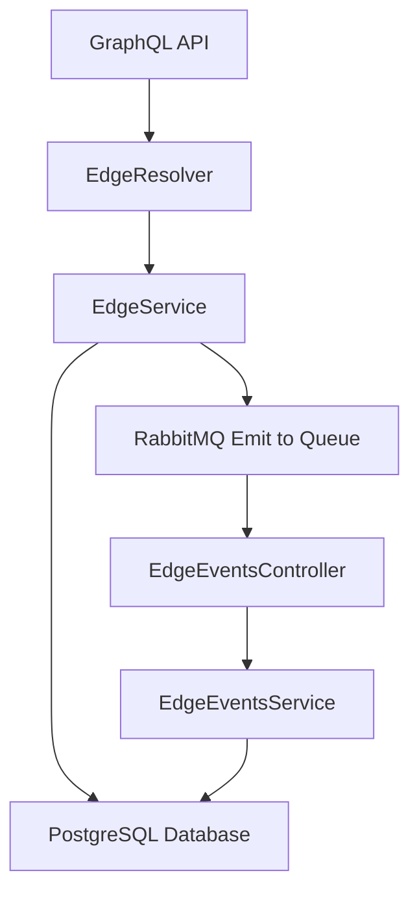

# 🚀 NestJS + GraphQL Demo

<p align="center">
  
  
  
  
</p>

<p align="center">
  A Lightning Network channel management API built with <strong>NestJS</strong>, <strong>GraphQL</strong>, and <strong>RabbitMQ</strong>
</p>

<p align="center">
  
  
  
  
  
  
</p>

---

This project demonstrates a **production-ready GraphQL API** for managing Lightning Network channel edges with real-time event processing:

### ✅ **Core Features**

- **GraphQL API** with TypeScript and code-first approach
- **CRUD Operations** for Lightning Network channel edges
- **RabbitMQ Integration** for event-driven architecture
- **Microservice Pattern** with event handlers in the same NestJS application
- **PostgreSQL** database with TypeORM
- **Auto-generated capacity** values between 10,000 and 1,000,000

### ✅ **API Endpoints**

- `getEdges` - Retrieve all channel edges
- `getEdge(id)` - Retrieve a specific edge by ID
- `createEdge({node1_alias, node2_alias})` - Create new channel edge from two node aliases

### ✅ **Event Processing**

- Publishes `edge.created` events to RabbitMQ on edge creation
- Consumes events and updates aliases with `-updated` suffix
- Console logging for monitoring channel creation

---

## 🏗️ Architecture Overview



### Key Architectural Decisions

- Hybrid Application: HTTP + Microservice in single NestJS app
- Event-driven Updates: Separate service handles database updates
- Clean Separation: Edge CRUD vs Event Processing responsibilities
- Production Configuration: Environment-based config with Docker support

## 🚀 Quick Start

### Option 1: Local Development (Recommended)

```bash
#1. Clone and install dependencies
git clone https://github.com/utxosvaldo/graphql-nestjs.git
cd graphql-nestjs
npm install

# 2. Set up Docker environment for postgres and rabbitmq services
cp .env.docker.example .env.docker
# Edit .env.docker with your preferred values

# 3. Start infrastructure services only
docker compose --profile dev up -d

# 4. Run NestJS locally with hot reload
npm run start:dev

# 5. Open GraphQL Playground
open http://localhost:3000/graphql
```

### Option 2: Full Docker Environment

```bash
# 1. Set up environment
cp .env.docker.example .env.docker
# Configure production values in .env.docker

# 2. Start all services
docker compose --profile prod up -d --build

# 3. Access the application
open http://localhost:3000/graphql
```

## 🔧 Environment Configuration

This project uses NestJS ConfigModule with environment-specific configurations:

### Local Development

- NestJS: Runs on your machine with hot reload
- Infrastructure: PostgreSQL + RabbitMQ in Docker containers
- Config: Uses `.env.local` file (checkout `.env.local.example`)

### Production/Docker

- Everything containerized: NestJS + PostgreSQL + RabbitMQ
- Config: Uses `.env.docker` file (checkout `.env.docker.example`)
- Security: Environment variables from external source

## 🧪 Testing the API

1. Create a Channel Edge

```graphql
mutation {
  createEdge(createEdgeInput: {
    node1_alias: "lightning-alice"
    node2_alias: "lightning-bob"
  }) {
    id
    capacity
    node1_alias
    node2_alias
    edge_peers
    created_at
    updated_at
  }
}
```

2. Query All Edges

```graphql
query {
  getEdges {
    id
    capacity
    node1_alias
    node2_alias
    edge_peers
    created_at
    updated_at
  }
}
```

3. Get Specific Edge

```graphql
query {
  getEdge(id: "your-edge-id-here") {
    id
    capacity
    node1_alias
    node2_alias
    edge_peers
  }
}
```

4. Observe Event Processing
   After creating an edge, check the console logs to see:

```bash
New channel between lightning-alice and lightning-bob with a capacity of 750000 has been created.
```

Then query the edge again to see updated aliases:

```json
{
  "node1_alias": "lightning-alice-updated",
  "node2_alias": "lightning-bob-updated",
  "edge_peers": "lightning-alice-updated-lightning-bob-updated"
}
```

## 🧪 Running Tests

```bash
# Unit tests
npm run test

# Test coverage
npm run test:cov
```

Test Coverage:

- ✅ EdgeService with mocked RabbitMQ
- ✅ EdgeResolver with dependency injection
- ✅ EdgeEventsService database operations
- ✅ EdgeEventsController message handling

## 📊 Services & Ports

| Service             | Port  | Description              |
| ------------------- | ----- | ------------------------ |
| NestJS API          | 3000  | GraphQL Playground + API |
| PostgreSQL          | 5432  | Database                 |
| RabbitMQ            | 5672  | AMQP Protocol            |
| RabbitMQ Management | 15672 | Web UI (admin/password)  |

## 🛠️ Technology Stack

### Core Framework

- NestJS - Enterprise Node.js framework with dependency injection
- TypeScript - Type-safe development
- GraphQL - Code-first API with Apollo Server

### Database & Storage

- PostgreSQL - Relational database
- TypeORM - Object-relational mapping with migrations

### Message Queue

- RabbitMQ - Event-driven messaging
- AMQP Protocol - Reliable message delivery

### DevOps & Testing

- Docker & Docker Compose - Containerization with profiles
- Jest - Unit and integration testing
- ConfigModule - Environment-based configuration

## 🏗️ Project Structure

```bash
├── src/
│   ├── edge/                 # Edge domain module
│   │   ├── edge.entity.ts    # Database entity
│   │   ├── edge.service.ts   # Business logic + RabbitMQ publishing
│   │   ├── edge.resolver.ts  # GraphQL resolvers
│   ├── events/               # Event processing module
│   │   ├── edge-events.controller.ts  # RabbitMQ consumer
│   │   ├── edge-events.service.ts     # Event handling logic
│   ├── rabbitmq/            # Message queue configuration
│   │   └── rabbitmq.module.ts
│   ├── app.module.ts         # Root application module
│   └── main.ts              # Application bootstrap
├── test/                    # Test files
├── docker compose.yml       # Multi-environment setup
├── .env.local.example      # Local development config template
├── .env.docker.example     # Docker environment template
└── Dockerfile              # Production container
```

## 🤝 Development Workflow

This project demonstrates enterprise development practices:

- Feature Development: Module-based architecture with clear separation of concerns
- Testing Strategy: Unit tests and mocking strategies for external dependencies
- Configuration Management: Environment-specific configs without secrets in repo
- Event-Driven Design: Microservice patterns within monolithic deployment
- Production Readiness: Docker, health checks, and deployment configuration

## 📝 Technical Notes

### Design Decisions

- Code-First GraphQL: Faster development with TypeScript integration
- Hybrid NestJS App: HTTP + Microservice in single process (as required)
- Event Sourcing Pattern: Separate event handling from CRUD operations
- Docker Profiles: Clean separation of development vs production environments
- TypeORM with UUID: Scalable primary keys for distributed systems

### Production Considerations

- Database migrations for schema evolution
- Message queue durability configuration
- Horizontal scaling with load balancers
- External secret management integration
- Monitoring and alerting setup
